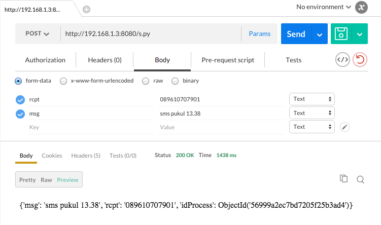
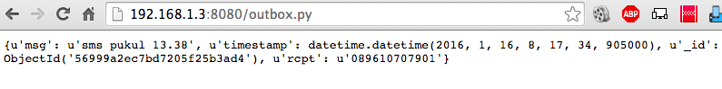
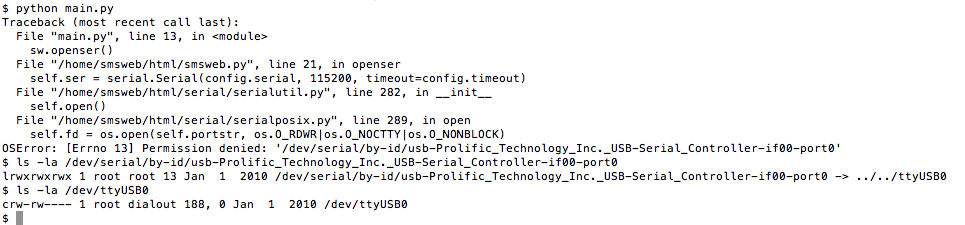
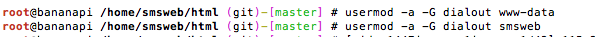
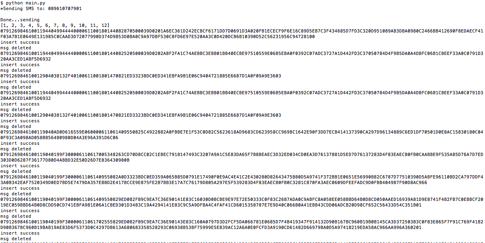
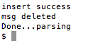
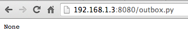

# smsweb
Asynchronous SMS Gateway Web Service. Tested on prolific serial chip(Wavecom Modem)

Made it for your notification and account verification Apps

## Pre Requisite
Pelase [Install MongoDB] first. and python-pip, then install this module using pip:
```sh
$ pip install serial pymongo messaging bson
```


## Using Apache and Centos
Tested on Centos 6

 ```sh
 # yum install httpd
 ``` 
 edit /etc/httpd/conf/httpd.conf
  
 ```sh
 <Directory "/var/www/html">
 	Options Indexes FollowSymLinks ExecCGI
    AddHandler cgi-script py
    AllowOverride None
    Order allow,deny
    Allow from all
 </Directory>
 ```
 on apache2 edit /etc/apache2/conf-available/serve-cgi-bin.conf

 ```
 <IfModule mod_alias.c>
	<IfModule mod_cgi.c>
		Define ENABLE_USR_LIB_CGI_BIN
	</IfModule>

	<IfModule mod_cgid.c>
		Define ENABLE_USR_LIB_CGI_BIN
	</IfModule>

	<IfDefine ENABLE_USR_LIB_CGI_BIN>
		ScriptAlias / /var/www/html/
		<Directory "/var/www/html">
			AllowOverride None
			Options +ExecCGI -MultiViews +SymLinksIfOwnerMatch
			AddHandler cgi-script py
			Require all granted
		</Directory>
	</IfDefine>
 </IfModule>

 ```


### Instalation
 1. add user apache and to to group dialout
    
    ```sh
	# usermod -G dialout apache
	# grep 'dialout' /etc/group
	```
 2. Download and extract smsweb in webserver folder(/var/www/html) with CGI enable
 3. edit config.py with your own configuration hardware and 
 4. Change owner as apache and mode 755 of smsweb by execute :
 
 ```sh
 # chown -R 755 /var/www/html
 # chown -R apache:apache /var/www/html/
 ```
 5. Change access mode for main.pid to 777
 ```sh
 # chown 777 main.pid
 ```
 6. Rename config-sample.py to config.py edit with your configuration server
 7. access your IP with browser
 
## Using Lighttpd on Raspbian

Dengan raspberry pi, instalasi lighttpd dan mod\_cgi jalankan perintah berikut

```sh
sudo apt-get install lighttpd
sudo lighty-enable-mod cgi
```

kemudian edit file konfigurasi di /etc/lighttpd/lighttpd.conf pastikan mod\_cgi sudah ada, jika belum tambahkan\(ini opsional\).

```sh
server.modules = (
            ...,
            "mod_cgi",
            ...,
)
```

tambahkan beberapa baris di akhir file tersebut agar web service bisa diakses melalui localhost/smsweb

```sh
$HTTP["url"] =~ "^/smsweb/" {
        cgi.assign = ( ".py" => "/usr/bin/python" )
}
```

reload lighttpd dengan perintah

```sh
sudo service lighttpd force-reload
```

Buat folder smsweb di dalam folder web server\(defaultnya /var/www/\), kemudian buat file test.py untuk mengetest apakah CGI di lighttpd berjalan dengan baik. isi file test :

```sh
#!/usr/bin/env python
"""
insert.py -  Program to :
1. insert to outbox collection, 
2. check if main is running? if not run then run
"""
print "Content-Type: text-html"
print
import cgitb
cgitb.enable()
import cgi
print "hai kawan"
```

panggil di web browser [http://localhost/smsweb/test.py](http://localhost/smsweb/test.py)  
apabila terbuka dan keluar di browser tulisan hai kawan, berarti settingan CGI sudah berhasil.

### Instalasi Kode Program smsweb

pertama kita menuju ke direktori web server kita kemudian lakukan git init dan git pull:

```sh
$ git init
$ git remote add origin https://github.com/awangga/smsweb.git
$ git pull
```

kemudian akses web server dengan browser anda dengan alamat [http://ipserver:port/s.py](http://ipserver:port/s.py) dengan menggunakan postman untuk chrome plugin.  
  
Untuk membuktikan koneksi ke mongodb telah berhasil kita akses [http://192.168.1.3:8080/outbox.py](http://192.168.1.3:8080/outbox.py) maka akan muncul record yang telah kita post pada postman tadi  


### Setting permission modem

Modem biasanya dimiliki oleh root dengan grup dialout sehingga tidak bisa diakses oleh user biasa,kita bisa mengeceknya dengan menjalankan script main.py python

```sh
$ python main.py
$ ls -la /dev/serial/by-id/usb-Prolific_Technology_Inc._USB-Serial_Controller-if00-port0
$ ls -la /dev/ttyUSB0
```

  
oleh karena itu user yang dipakai oleh web server dan smsweb dimasukkan ke group dialout dari modem kita rubah agah bisa diakses oleh user smsweb dan webserver.

```sh
# usermod -a -G dialout www-data
# usermod -a -G dialout smsweb
```

  
kemudian kita restart server dengan perintah reboot dan coba kembali menjalankan main.py  
  
kita akan menemukan Done...parsing



berarti data outbox dan inbox sudah dibaca, pertanda sukses adalah dengan membuka [http://192.168.1.3:8080/outbox.py](http://192.168.1.3:8080/outbox.py) maka keluar none




## API Access
 1. sending sms
 
 ```sh
 http://localhost/s.py 
 with POST method, parameter :
 rcpt = number,number ex. 081312000300,08997788921,0879989892383
 msg = this is a message
 ```
 2. Outbox sms
 
 ```sh
 http://localhost/outbox.py
 ```
 3. Sentitems sms
 
 ```sh
 http://localhost/sentitems.py
 ```
 4. Errornumber log
 
 ```sh
 http://localhost/errors.py
 ```
 


## User Manual
 1. [Indonesia Manual Book]
 
[Install MongoDB]:http://andres.jaimes.net/870/setup-mongo-on-centos-6/
[Indonesia Manual Book]:https://awangga.gitbooks.io/sms-web-service-untuk-pemula/content/chapter1.html
